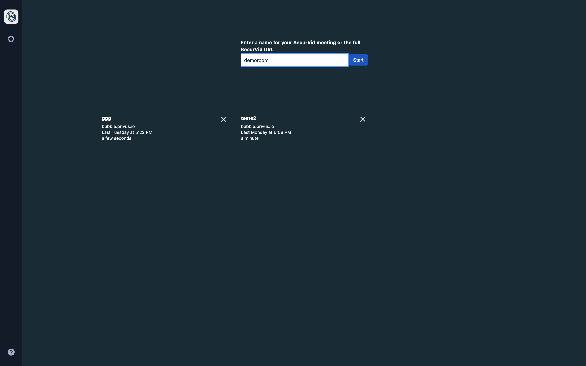

# SecurVid Electron Desktop App

Desktop application for [Privus SecurVid] built with [Electron] and forked from jitsi-meet.

## Download

[Linux (AppImage)](https://github.com/privussec/securvid_desktop/releases/latest/download/securvid-x86_64.AppImage) | [Mac (dmg)](https://github.com/privussec/securvid_desktop/releases/latest/download/securvid.dmg) | [Windows (exe)](https://github.com/privussec/securvid_desktop/releases/latest/download/securvid.exe)

## Features

- [End-to-End Encryption] support by using a double layered approach (signaling and media)
- Builtin auto-updates
- Always-On-Top window
- Support for English, French, Portuguese, Spanish and German languages
- Support for deeplinks such as `securvid://myroom` (will open `myroom` on the configured SecurVid instance) or `securvid://sv.privus.io/myroom` (will open `myroom` on the SecurVid server)

## Installation

Download our latest release and you're all set! The supported platforms
are macOS, Windows, and GNU/Linux (all 64bits only).

## License

Apache 2. See the LICENSE file.

